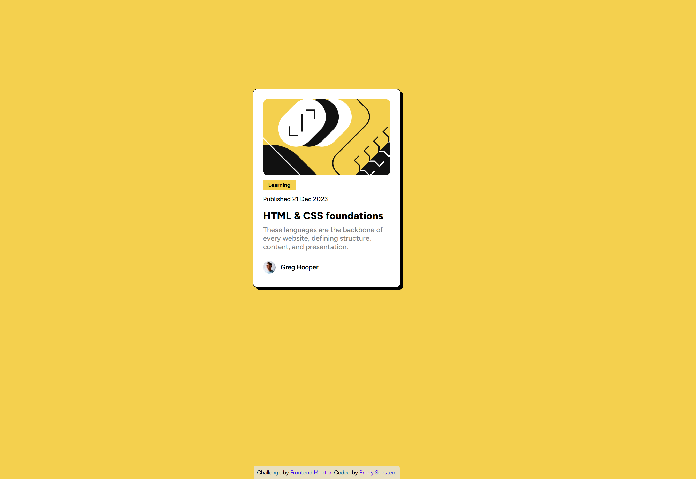

# Frontend Mentor - Blog preview card solution

This is a solution to the [Blog preview card challenge on Frontend Mentor](https://www.frontendmentor.io/challenges/blog-preview-card-ckPaj01IcS).

## Table of contents

- [Overview](#overview)
  - [The challenge](#the-challenge)
  - [Screenshot](#screenshot)
  - [Links](#links)
- [My process](#my-process)
  - [Built with](#built-with)
  - [What I learned](#what-i-learned)
  - [Continued development](#continued-development)
  - [Useful resources](#useful-resources)
  - [AI Collaboration](#ai-collaboration)

**Note: Delete this note and update the table of contents based on what sections you keep.**

## Overview

This is the second challenge I'm doing for Frontend Mentor. The card is developed solely using HTML and CSS, alongside custom fonts. 

### The challenge

Users should be able to:

- See hover and focus states for all interactive elements on the page

### Screenshot

### Links

- Live Site URL: [Click here to see the live site](https://your-live-site-url.com)

## My process

My process for creating this was siginificantly faster than my previous challenge, as I now had a good understanding of how to use flexbox to center a div, and how to structure content. I also began with an external CSS sheet instead of starting with inline styles and moving them later. Using VS Code's Live Preview extension was also great here. 

### Built with

- Semantic HTML5 markup
- CSS custom properties
- Flexbox

### What I learned

I wasn't familiar with custom hosted fonts, or particularly variable fonts, in CSS. This was interesting to explore. I also got a good refresher on the `:hover` pseudo-class and how it relates to child components. This was also a good exercise in quick prototyping. 

### Continued development

I want to continue learning about custom fonts and variable fonts, and the best way to use them efficiently within a site. I'm continuing to expand on my understanding and use of flexbox. I'd also like to better understand relative units, I feel like I am using trial and error to determine padding values, font sizes/weights, etc and am not certain if there's a better approach.

### Useful resources

Again, CSS-Tricks came in handy here.
- [CSS-Tricks: Variable Fonts](https://css-tricks.com/newsletter/259-how-to-use-variable-fonts/) - This helped me understand how to use hosted fonts and set up variable font weights.  

### AI Collaboration

I utilized Claude code when stuck for this project, which only occurred once or twice. Specifically, it was helpful in determining how to place the author image inline with the author name. 